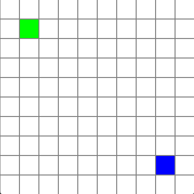

# Bomberman - DynaBlaster

## Opis projektu

W ramach projektu należało stworzyć aplikację wykorzystującą wielowątkowość oraz sekcje krytyczne (w naszym przypadku semafory). Utworzona gra opiera się na klasycznej wersji dwuosobowego Bombermana. Zadaniem każdego z graczy jest wyeliminowanie przeciwnika poprzez eksplozję bomby.

## Sterowanie

Gracze sterują swoimi postaciami (kwadratami w odpowiednim kolorze) za pomocą klawiszy AWSD oraz NUM4,NUM8,NUM5 i NUM6. Bomby podkładane są przyciskami F dla gracza 1 oraz NUM+ dla gracza 2. Podłożona bomba eksploduje po 3 sekundach na obszarze krzyża o wymiarach 5x5. Sama plansza gry ma 10x10 miejsc.

## Grafika

## Wątki
- player1_thread - reprezentuje pierwszego gracza
- player2_thread - reprezentuje drugiego gracza
- board_thread - reprezentuje plansze do gry

## Sekcje krytyczne
Sekcja krytyczna którą zaimplementowaliśmy w naszym programie to semafor - służacy do synchronizacji dostępu do planszy. Przeciwdziała on przypadkom, w których dwa wątki jednocześnie miałyby dostęp do tego samego pola na planszy
